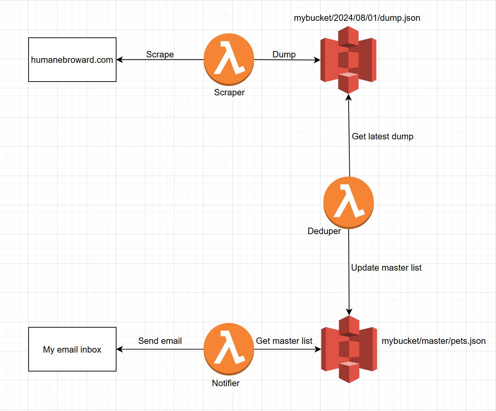

# Pet Adoption Notifier

This application scrapes the Broward County Humane Society's pet adoption [website](https://humanebroward.com/all-pets/?pg=1) and emails me a list of pets that are currently available for adoption.

It filters out dog breeds I'm not interested in, and it notifies me only when there are new pets to adopt.

---

# Architecture

**Note:** Technically I use only a single S3 bucket, but I display it as two entities in the diagram for readability.

## Scraper
* Scrapes the website for pets and removes any breeds that are part of my personal deny list.
* Saves all pets it finds to a JSON file in S3.
* Runs every 25 minutes.

## Deduper
* Reacts to new data saved by the scraper.
* Gets the latest scraper dump and the current master list.
* Adds new pets to the master list.
* Removes pets from the master list if they are not present in the latest scraper dump (indicates pets not available anymore).

## Notifier
* Reacts to a new master list saved by the deduper.
* Gets the master list, formats the data into HTML, and sends the HTML as an email to my inbox.

---

# Setup

## Prerequisites
* Your own AWS account.
* An IAM user with permission to deploy everything. You can give it full admin access, or give it access to only the services relevant to this project.
  * `AmazonEventBridgeFullAccess` - Needed to create the 25 minute schedule for our scraper.
  * `AmazonS3FullAccess` - Needed to create the S3 bucket for data storage.
  * `AmazonSESFullAccess` - Needed to create the verified identity for your email.
  * `AWSCloudFormationFullAccess` - Needed to deploy using CloudFormation.
  * `AWSLambda_FullAccess` - Needed to create the lambda functions.
  * `CloudWatchFullAccessV2` - Needed to set up logging for the lambdas.
  * `IAMFullAccess` - Needed to create the IAM role(s) used by the lambdas.
* Generate access key and secret key for this user, and save to an AWS profile on your machine. The profile name should match whatever is in serverless.yml, in the `provider.profile` value.
* An email address whose inbox you have full access to.

## Deployment
1. Make sure the email address values in serverless.yml contain **your** email address.
1. From the project root, run: `serverless deploy`
1. You will receive a confirmation email **during the stack deployment**. You must copy the link from the email and paste it into a browser to confirm. Deployment will not succeed if you ignore this step.
1. A few minutes after email confirmation, the stack should finish deploying.

## Tear down
If you want to remove all resources from your AWS account...
1. You must manually delete the data files from the S3 bucket.
1. After clearing the S3 bucket, run this from the project root: `serverless remove`

## Testing
If you don't want to wait 25 minutes for the scheduler to run, you can test the lambda directly in the AWS console.
1. Go to CloudWatch.
1. On the left nav bar, go to "Live Tail."
1. In the left bar, find the dropdown menu to select log groups.
1. Select the three log groups for your lambdas (scraper, deduper, notifier).
1. Click "Apply Filters," OR click the "Start" button. Both will do the same thing and start monitoring all your log groups.
1. **In another tab**, go to your scraper function in the AWS console.
1. In the "Test" tab, click the "Test" button.
1. While the function is running, go back to your CloudWatch tab where the live tail is running.
1. You should see logs start to appear telling you what is happening in the code.